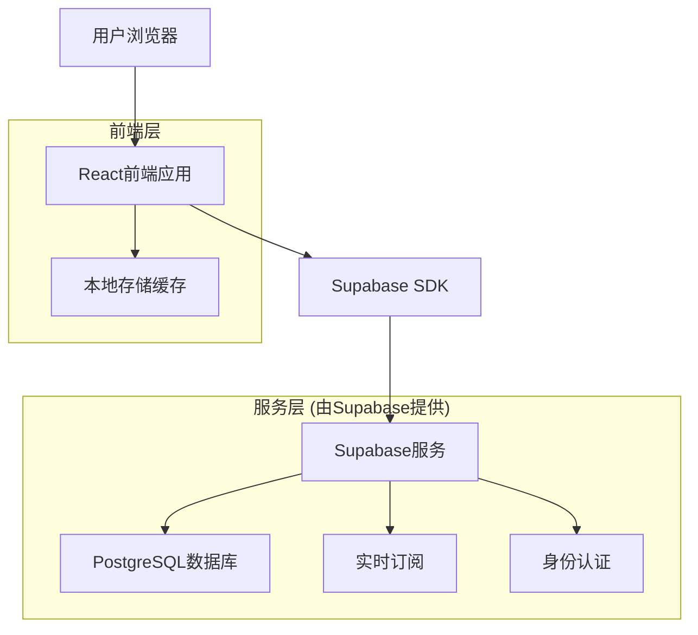
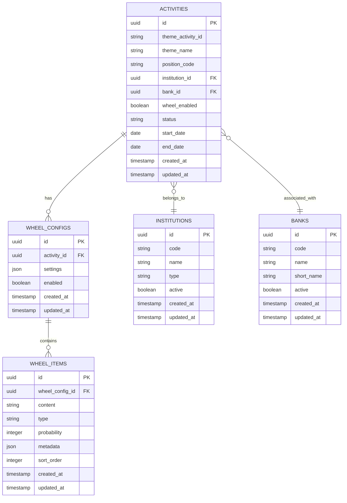

# 主题活动管理系统技术架构文档

## 1. 架构设计



## 2. 技术描述

* **前端**: React\@18 + TypeScript + Tailwind CSS + Vite

* **后端**: Supabase (PostgreSQL + 实时API + 身份认证)

* **状态管理**: React Context + useReducer

* **UI组件**: 自定义组件库 + Headless UI

* **构建工具**: Vite

* **部署**: Vercel

## 3. 路由定义

| 路由              | 用途                   |
| --------------- | -------------------- |
| /               | 首页，重定向到活动管理页面        |
| /activities     | 主题活动管理页面，显示活动列表和筛选功能 |
| /activities/:id | 活动详情页面，显示和编辑活动信息     |
| /wheel-config   | 转盘配置页面，管理转盘内容和设置     |
| /institutions   | 机构管理页面，管理报名机构和关联银行   |
| /login          | 登录页面，用户身份认证          |
| /profile        | 用户资料页面，显示用户信息和设置     |

## 4. API定义

### 4.1 核心API

**活动查询相关**

```typescript
// 查询活动列表
GET /api/activities
```

请求参数:

| 参数名称            | 参数类型    | 是否必需  | 描述        |
| --------------- | ------- | ----- | --------- |
| page            | number  | false | 页码，默认1    |
| pageSize        | number  | false | 每页数量，默认10 |
| themeActivityId | string  | false | 主题活动ID    |
| themeName       | string  | false | 主题名称关键字   |
| positionCode    | string  | false | 头寸编号      |
| institutionId   | string  | false | 报名机构ID    |
| bankId          | string  | false | 关联银行ID    |
| wheelEnabled    | boolean | false | 是否开启大转盘   |
| status          | string  | false | 活动状态      |
| startDate       | string  | false | 开始日期      |
| endDate         | string  | false | 结束日期      |

响应:

| 参数名称     | 参数类型        | 描述   |
| -------- | ----------- | ---- |
| data     | Activity\[] | 活动列表 |
| total    | number      | 总数量  |
| page     | number      | 当前页码 |
| pageSize | number      | 每页数量 |

示例:

```json
{
  "data": [
    {
      "id": "act_001",
      "themeActivityId": "theme_001",
      "themeName": "春节优惠活动",
      "positionCode": "POS001",
      "institutionName": "招商银行",
      "bankName": "中国银行",
      "wheelEnabled": true,
      "status": "active",
      "startDate": "2025-01-20",
      "endDate": "2025-02-20",
      "createdAt": "2025-01-20T10:00:00Z",
      "updatedAt": "2025-01-20T10:00:00Z"
    }
  ],
  "total": 100,
  "page": 1,
  "pageSize": 10
}
```

**转盘配置相关**

```typescript
// 获取转盘配置
GET /api/wheel-config/:activityId

// 更新转盘配置
PUT /api/wheel-config/:activityId
```

请求:

| 参数名称     | 参数类型          | 是否必需 | 描述     |
| -------- | ------------- | ---- | ------ |
| items    | WheelItem\[]  | true | 转盘项目列表 |
| settings | WheelSettings | true | 转盘设置   |

响应:

| 参数名称    | 参数类型    | 描述     |
| ------- | ------- | ------ |
| success | boolean | 操作是否成功 |
| message | string  | 响应消息   |

**机构和银行管理**

```typescript
// 搜索机构
GET /api/institutions/search?keyword=关键字

// 搜索银行
GET /api/banks/search?keyword=关键字
```

## 5. 数据模型

### 5.1 数据模型定义



### 5.2 数据定义语言

**活动表 (activities)**

```sql
-- 创建活动表
CREATE TABLE activities (
    id UUID PRIMARY KEY DEFAULT gen_random_uuid(),
    theme_activity_id VARCHAR(50) NOT NULL,
    theme_name VARCHAR(200) NOT NULL,
    position_code VARCHAR(50),
    institution_id UUID REFERENCES institutions(id),
    bank_id UUID REFERENCES banks(id),
    wheel_enabled BOOLEAN DEFAULT false,
    status VARCHAR(20) DEFAULT 'active' CHECK (status IN ('active', 'inactive', 'terminated')),
    start_date DATE,
    end_date DATE,
    created_at TIMESTAMP WITH TIME ZONE DEFAULT NOW(),
    updated_at TIMESTAMP WITH TIME ZONE DEFAULT NOW()
);

-- 创建索引
CREATE INDEX idx_activities_theme_activity_id ON activities(theme_activity_id);
CREATE INDEX idx_activities_institution_id ON activities(institution_id);
CREATE INDEX idx_activities_bank_id ON activities(bank_id);
CREATE INDEX idx_activities_status ON activities(status);
CREATE INDEX idx_activities_dates ON activities(start_date, end_date);

-- 设置权限
GRANT SELECT ON activities TO anon;
GRANT ALL PRIVILEGES ON activities TO authenticated;
```

**机构表 (institutions)**

```sql
-- 创建机构表
CREATE TABLE institutions (
    id UUID PRIMARY KEY DEFAULT gen_random_uuid(),
    code VARCHAR(20) UNIQUE NOT NULL,
    name VARCHAR(200) NOT NULL,
    type VARCHAR(50) DEFAULT 'bank',
    active BOOLEAN DEFAULT true,
    created_at TIMESTAMP WITH TIME ZONE DEFAULT NOW(),
    updated_at TIMESTAMP WITH TIME ZONE DEFAULT NOW()
);

-- 创建索引
CREATE INDEX idx_institutions_code ON institutions(code);
CREATE INDEX idx_institutions_name ON institutions USING gin(name gin_trgm_ops);
CREATE INDEX idx_institutions_active ON institutions(active);

-- 设置权限
GRANT SELECT ON institutions TO anon;
GRANT ALL PRIVILEGES ON institutions TO authenticated;

-- 初始数据
INSERT INTO institutions (code, name, type) VALUES
('ICBC', '中国工商银行', 'bank'),
('CCB', '中国建设银行', 'bank'),
('ABC', '中国农业银行', 'bank'),
('BOC', '中国银行', 'bank'),
('CMB', '招商银行', 'bank'),
('SPDB', '浦发银行', 'bank'),
('CIB', '兴业银行', 'bank'),
('CITIC', '中信银行', 'bank');
```

**银行表 (banks)**

```sql
-- 创建银行表
CREATE TABLE banks (
    id UUID PRIMARY KEY DEFAULT gen_random_uuid(),
    code VARCHAR(20) UNIQUE NOT NULL,
    name VARCHAR(200) NOT NULL,
    short_name VARCHAR(50),
    active BOOLEAN DEFAULT true,
    created_at TIMESTAMP WITH TIME ZONE DEFAULT NOW(),
    updated_at TIMESTAMP WITH TIME ZONE DEFAULT NOW()
);

-- 创建索引
CREATE INDEX idx_banks_code ON banks(code);
CREATE INDEX idx_banks_name ON banks USING gin(name gin_trgm_ops);
CREATE INDEX idx_banks_active ON banks(active);

-- 设置权限
GRANT SELECT ON banks TO anon;
GRANT ALL PRIVILEGES ON banks TO authenticated;

-- 初始数据
INSERT INTO banks (code, name, short_name) VALUES
('ICBC', '中国工商银行股份有限公司', '工商银行'),
('CCB', '中国建设银行股份有限公司', '建设银行'),
('ABC', '中国农业银行股份有限公司', '农业银行'),
('BOC', '中国银行股份有限公司', '中国银行'),
('BOCOM', '交通银行股份有限公司', '交通银行'),
('CMB', '招商银行股份有限公司', '招商银行'),
('SPDB', '上海浦东发展银行股份有限公司', '浦发银行'),
('CIB', '兴业银行股份有限公司', '兴业银行');
```

**转盘配置表 (wheel\_configs)**

```sql
-- 创建转盘配置表
CREATE TABLE wheel_configs (
    id UUID PRIMARY KEY DEFAULT gen_random_uuid(),
    activity_id UUID REFERENCES activities(id) ON DELETE CASCADE,
    settings JSONB DEFAULT '{}',
    enabled BOOLEAN DEFAULT true,
    created_at TIMESTAMP WITH TIME ZONE DEFAULT NOW(),
    updated_at TIMESTAMP WITH TIME ZONE DEFAULT NOW()
);

-- 创建索引
CREATE INDEX idx_wheel_configs_activity_id ON wheel_configs(activity_id);
CREATE INDEX idx_wheel_configs_enabled ON wheel_configs(enabled);

-- 设置权限
GRANT SELECT ON wheel_configs TO anon;
GRANT ALL PRIVILEGES ON wheel_configs TO authenticated;
```

**转盘项目表 (wheel\_items)**

```sql
-- 创建转盘项目表
CREATE TABLE wheel_items (
    id UUID PRIMARY KEY DEFAULT gen_random_uuid(),
    wheel_config_id UUID REFERENCES wheel_configs(id) ON DELETE CASCADE,
    content TEXT NOT NULL,
    type VARCHAR(50) DEFAULT 'prize',
    probability INTEGER DEFAULT 0 CHECK (probability >= 0 AND probability <= 100),
    metadata JSONB DEFAULT '{}',
    sort_order INTEGER DEFAULT 0,
    created_at TIMESTAMP WITH TIME ZONE DEFAULT NOW(),
    updated_at TIMESTAMP WITH TIME ZONE DEFAULT NOW()
);

-- 创建索引
CREATE INDEX idx_wheel_items_wheel_config_id ON wheel_items(wheel_config_id);
CREATE INDEX idx_wheel_items_sort_order ON wheel_items(sort_order);

-- 设置权限
GRANT SELECT ON wheel_items TO anon;
GRANT ALL PRIVILEGES ON wheel_items TO authenticated;
```

## 6. 前端技术实现

### 6.1 组件架构

```typescript
// 主要组件结构
src/
├── components/
│   ├── common/
│   │   ├── Button.tsx
│   │   ├── Input.tsx
│   │   ├── Select.tsx
│   │   ├── Modal.tsx
│   │   └── Table.tsx
│   ├── activities/
│   │   ├── ActivityList.tsx
│   │   ├── ActivityFilter.tsx
│   │   ├── ActivityForm.tsx
│   │   └── BatchOperations.tsx
│   ├── wheel/
│   │   ├── WheelConfig.tsx
│   │   ├── WheelItemList.tsx
│   │   └── WheelPreview.tsx
│   └── institutions/
│       ├── InstitutionSelect.tsx
│       └── BankSelect.tsx
├── hooks/
│   ├── useActivities.ts
│   ├── useWheelConfig.ts
│   ├── useInstitutions.ts
│   └── useBanks.ts
├── services/
│   ├── supabase.ts
│   ├── activities.ts
│   ├── wheel.ts
│   └── institutions.ts
├── types/
│   ├── activity.ts
│   ├── wheel.ts
│   └── institution.ts
└── utils/
    ├── debounce.ts
    ├── validation.ts
    └── formatting.ts
```

### 6.2 关键功能实现

**智能搜索下拉选择组件**

```typescript
// components/common/SearchableSelect.tsx
import React, { useState, useEffect, useRef } from 'react';
import { debounce } from '../../utils/debounce';

interface Option {
  id: string;
  name: string;
  code?: string;
}

interface SearchableSelectProps {
  options: Option[];
  value?: string;
  placeholder?: string;
  onSelect: (option: Option) => void;
  onSearch?: (keyword: string) => void;
}

export const SearchableSelect: React.FC<SearchableSelectProps> = ({
  options,
  value,
  placeholder,
  onSelect,
  onSearch
}) => {
  const [isOpen, setIsOpen] = useState(false);
  const [searchTerm, setSearchTerm] = useState('');
  const [filteredOptions, setFilteredOptions] = useState(options);
  const inputRef = useRef<HTMLInputElement>(null);
  const dropdownRef = useRef<HTMLDivElement>(null);

  const debouncedSearch = debounce((term: string) => {
    if (onSearch) {
      onSearch(term);
    } else {
      const filtered = options.filter(option =>
        option.name.toLowerCase().includes(term.toLowerCase()) ||
        (option.code && option.code.toLowerCase().includes(term.toLowerCase()))
      );
      setFilteredOptions(filtered);
    }
  }, 300);

  useEffect(() => {
    debouncedSearch(searchTerm);
  }, [searchTerm]);

  useEffect(() => {
    setFilteredOptions(options);
  }, [options]);

  useEffect(() => {
    const handleClickOutside = (event: MouseEvent) => {
      if (
        dropdownRef.current &&
        !dropdownRef.current.contains(event.target as Node) &&
        inputRef.current &&
        !inputRef.current.contains(event.target as Node)
      ) {
        setIsOpen(false);
      }
    };

    document.addEventListener('mousedown', handleClickOutside);
    return () => {
      document.removeEventListener('mousedown', handleClickOutside);
    };
  }, []);

  const handleInputChange = (e: React.ChangeEvent<HTMLInputElement>) => {
    setSearchTerm(e.target.value);
    setIsOpen(true);
  };

  const handleOptionSelect = (option: Option) => {
    setSearchTerm(option.name);
    setIsOpen(false);
    onSelect(option);
  };

  return (
    <div className="relative">
      <input
        ref={inputRef}
        type="text"
        value={searchTerm}
        placeholder={placeholder}
        onChange={handleInputChange}
        onFocus={() => setIsOpen(true)}
        className="w-full px-3 py-2 border border-gray-300 rounded-md focus:outline-none focus:ring-2 focus:ring-blue-500"
      />
      
      {isOpen && (
        <div
          ref={dropdownRef}
          className="absolute z-50 w-full mt-1 bg-white border border-gray-300 rounded-md shadow-lg max-h-60 overflow-y-auto"
        >
          {filteredOptions.length > 0 ? (
            filteredOptions.map((option) => (
              <div
                key={option.id}
                onClick={() => handleOptionSelect(option)}
                className="px-3 py-2 cursor-pointer hover:bg-gray-100 border-b border-gray-100 last:border-b-0"
              >
                <div className="font-medium">{option.name}</div>
                {option.code && (
                  <div className="text-sm text-gray-500">{option.code}</div>
                )}
              </div>
            ))
          ) : (
            <div className="px-3 py-2 text-gray-500">暂无匹配结果</div>
          )}
        </div>
      )}
    </div>
  );
};
```

**活动筛选Hook**

```typescript
// hooks/useActivities.ts
import { useState, useEffect } from 'react';
import { supabase } from '../services/supabase';
import { Activity, ActivityFilters } from '../types/activity';

export const useActivities = () => {
  const [activities, setActivities] = useState<Activity[]>([]);
  const [loading, setLoading] = useState(false);
  const [total, setTotal] = useState(0);
  const [page, setPage] = useState(1);
  const [pageSize, setPageSize] = useState(10);

  const fetchActivities = async (filters: ActivityFilters = {}) => {
    setLoading(true);
    try {
      let query = supabase
        .from('activities')
        .select(`
          *,
          institutions(id, name, code),
          banks(id, name, code)
        `, { count: 'exact' })
        .range((page - 1) * pageSize, page * pageSize - 1);

      // 应用筛选条件
      if (filters.themeActivityId) {
        query = query.eq('theme_activity_id', filters.themeActivityId);
      }
      if (filters.themeName) {
        query = query.ilike('theme_name', `%${filters.themeName}%`);
      }
      if (filters.positionCode) {
        query = query.eq('position_code', filters.positionCode);
      }
      if (filters.institutionId) {
        query = query.eq('institution_id', filters.institutionId);
      }
      if (filters.bankId) {
        query = query.eq('bank_id', filters.bankId);
      }
      if (filters.wheelEnabled !== undefined) {
        query = query.eq('wheel_enabled', filters.wheelEnabled);
      }
      if (filters.status) {
        query = query.eq('status', filters.status);
      }
      if (filters.startDate) {
        query = query.gte('start_date', filters.startDate);
      }
      if (filters.endDate) {
        query = query.lte('end_date', filters.endDate);
      }

      const { data, error, count } = await query;

      if (error) throw error;

      setActivities(data || []);
      setTotal(count || 0);
    } catch (error) {
      console.error('获取活动列表失败:', error);
    } finally {
      setLoading(false);
    }
  };

  const batchTerminate = async (activityIds: string[]) => {
    try {
      const { error } = await supabase
        .from('activities')
        .update({ status: 'terminated' })
        .in('id', activityIds);

      if (error) throw error;

      // 刷新列表
      fetchActivities();
      return { success: true };
    } catch (error) {
      console.error('批量终止失败:', error);
      return { success: false, error };
    }
  };

  return {
    activities,
    loading,
    total,
    page,
    pageSize,
    setPage,
    setPageSize,
    fetchActivities,
    batchTerminate
  };
};
```

## 7. 部署配置

### 7.1 Vercel部署配置

```json
// vercel.json
{
  "framework": "vite",
  "buildCommand": "npm run build",
  "outputDirectory": "dist",
  "installCommand": "npm install",
  "env": {
    "VITE_SUPABASE_URL": "@supabase_url",
    "VITE_SUPABASE_ANON_KEY": "@supabase_anon_key"
  },
  "headers": [
    {
      "source": "/(.*)",
      "headers": [
        {
          "key": "X-Content-Type-Options",
          "value": "nosniff"
        },
        {
          "key": "X-Frame-Options",
          "value": "DENY"
        },
        {
          "key": "X-XSS-Protection",
          "value": "1; mode=block"
        }
      ]
    }
  ],
  "rewrites": [
    {
      "source": "/((?!api/).*)",
      "destination": "/index.html"
    }
  ]
}
```

### 7.2 环境变量配置

```bash
# .env.local
VITE_SUPABASE_URL=your_supabase_project_url
VITE_SUPABASE_ANON_KEY=your_supabase_anon_key
VITE_APP_ENV=production
```

### 7.3 构建优化

```typescript
// vite.config.ts
import { defineConfig } from 'vite';
import react from '@vitejs/plugin-react';
import { resolve } from 'path';

export default defineConfig({
  plugins: [react()],
  resolve: {
    alias: {
      '@': resolve(__dirname, 'src'),
    },
  },
  build: {
    rollupOptions: {
      output: {
        manualChunks: {
          vendor: ['react', 'react-dom'],
          supabase: ['@supabase/supabase-js'],
        },
      },
    },
    chunkSizeWarningLimit: 1000,
  },
  optimizeDeps: {
    include: ['react', 'react-dom', '@supabase/supabase-js'],
  },
});
```

