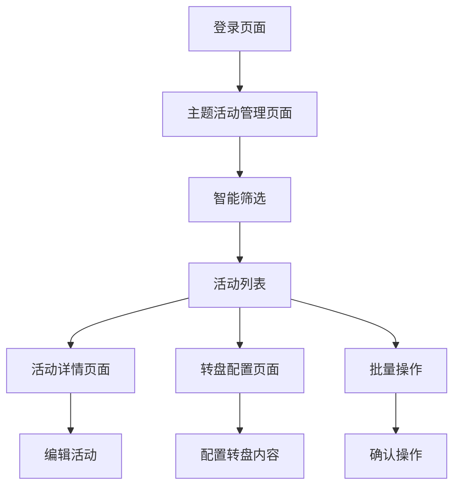

# 主题活动管理系统需求文档

## 1. 产品概述

主题活动管理系统是一个基于Web的企业级活动管理平台，专门用于管理微信优惠券营销活动的全生命周期。系统提供活动创建、查询、编辑、终止等核心功能，支持批量操作和多渠道管理，同时集成了大转盘配置功能，为用户提供丰富的互动体验。

该系统解决了传统活动管理中操作复杂、效率低下的问题，通过直观的界面设计和智能化的筛选功能，帮助运营人员快速管理大量活动数据，提升工作效率。

## 2. 核心功能

### 2.1 用户角色

| 角色   | 注册方式     | 核心权限                |
| ---- | -------- | ------------------- |
| 运营人员 | 企业内部账号登录 | 可查看、创建、编辑活动，配置转盘内容  |
| 管理员  | 系统管理员分配  | 拥有所有权限，可进行批量操作和系统配置 |

### 2.2 功能模块

我们的主题活动管理系统包含以下主要页面：

1. **主题活动管理页面**：活动列表展示、智能筛选、批量操作功能
2. **活动详情页面**：活动信息查看、编辑表单、状态管理
3. **转盘配置页面**：转盘内容设置、奖品配置、显示效果预览
4. **机构管理页面**：报名机构管理、关联银行配置

### 2.3 页面详情

| 页面名称     | 模块名称   | 功能描述                                                            |
| -------- | ------ | --------------------------------------------------------------- |
| 主题活动管理页面 | 智能筛选区域 | 支持主题活动ID、主题名称、头寸编号精确查询；报名机构和关联银行支持关键字搜索下拉选择；是否开启大转盘、状态、活动时间范围筛选 |
| 主题活动管理页面 | 活动列表展示 | 表格形式展示活动数据，支持排序、分页；状态标识可视化；操作列提供查看、编辑、终止功能                      |
| 主题活动管理页面 | 批量操作区域 | 全选/取消全选功能；批量终止活动；操作确认弹窗                                         |
| 转盘配置页面   | 转盘内容配置 | 转盘显示内容列表，固定240px宽度，内容居中对齐；支持添加、编辑、删除转盘项目                        |
| 转盘配置页面   | 模态框交互  | 配置确定按钮优化交互，先关闭配置模态框再显示确认弹窗，避免重叠问题                               |
| 机构管理页面   | 机构筛选配置 | 报名机构和关联银行管理，支持关键字搜索、智能匹配、自动填充功能                                 |

## 3. 核心流程

### 主要用户操作流程

**运营人员流程：**

1. 登录系统 → 进入主题活动管理页面
2. 使用智能筛选功能查找目标活动（支持关键字搜索下拉选择）
3. 查看活动详情或进行编辑操作
4. 配置大转盘内容（如需要）
5. 执行批量操作（如批量终止活动）

**管理员流程：**

1. 登录系统 → 访问所有管理页面
2. 配置机构和银行信息
3. 管理用户权限和系统设置
4. 监控系统运行状态



## 4. 用户界面设计

### 4.1 设计风格

* **主色调**：#409eff（主要按钮、链接），#67c23a（成功状态）

* **辅助色**：#e6a23c（警告），#f56c6c（危险操作），#909399（信息提示）

* **按钮样式**：圆角设计，悬停效果，3D阴影

* **字体**：14px基础字体，16px标题字体，12px辅助说明

* **布局风格**：卡片式设计，顶部导航，左侧菜单，响应式布局

* **图标风格**：线性图标，简洁现代，支持多种尺寸

### 4.2 页面设计概览

| 页面名称     | 模块名称   | UI元素                                                        |
| -------- | ------ | ----------------------------------------------------------- |
| 主题活动管理页面 | 智能筛选区域 | 输入框采用圆角边框设计；下拉选择器支持关键字搜索，悬停高亮效果；筛选项水平对齐，间距20px；重置和搜索按钮采用主色调 |
| 主题活动管理页面 | 活动列表   | 表格采用斑马纹设计；状态标签使用不同颜色标识；操作按钮悬停变色；分页组件底部居中                    |
| 转盘配置页面   | 配置表格   | 转盘显示内容列固定240px宽度；内容卡片居中对齐；添加/删除按钮图标化设计                      |
| 转盘配置页面   | 模态框    | 确定按钮优化交互逻辑；弹窗层级管理；背景遮罩半透明效果                                 |

### 4.3 响应式设计

系统采用桌面优先的响应式设计，支持1920px、1366px、1024px等主流分辨率。在小屏幕设备上，侧边菜单自动收起，表格支持横向滚动，确保核心功能在各种设备上都能正常使用。

## 5. 技术实现要点

### 5.1 转盘配置优化

**固定列宽实现：**

```css
.config-table th:nth-child(2),
.config-table td:nth-child(2) {
    width: 240px;
    min-width: 240px;
    max-width: 240px;
}

.config-table td:nth-child(2) {
    text-align: center;
    padding: 8px;
}

.activity-content-card {
    width: 100%;
    max-width: 220px;
    margin: 0 auto;
    display: flex;
    align-items: center;
    justify-content: center;
}
```

### 5.2 模态框交互优化

**优化后的确定按钮逻辑：**

```javascript
function showConfigWheelConfirm() {
    // 先关闭配置转盘模态框
    closeConfigWheelModal();
    
    // 延迟显示确认弹窗，确保模态框完全关闭
    setTimeout(() => {
        const modal = document.getElementById('configWheelConfirmModal');
        modal.style.display = 'flex';
        setTimeout(() => {
            modal.classList.add('show');
        }, 10);
    }, 100);
}
```

### 5.3 智能筛选增强

**关键字搜索下拉选择实现：**

```javascript
function createSearchableSelect(inputId, optionsData) {
    const input = document.getElementById(inputId);
    const dropdown = createDropdownElement();
    
    input.addEventListener('input', function(e) {
        const keyword = e.target.value.toLowerCase();
        const filteredOptions = optionsData.filter(option => 
            option.name.toLowerCase().includes(keyword) ||
            option.code.toLowerCase().includes(keyword)
        );
        updateDropdownOptions(dropdown, filteredOptions);
    });
    
    // 外部点击关闭下拉框
    document.addEventListener('click', function(e) {
        if (!input.contains(e.target) && !dropdown.contains(e.target)) {
            dropdown.style.display = 'none';
        }
    });
}
```

**筛选区域样式优化：**

```css
.query-form {
    display: flex;
    flex-wrap: wrap;
    gap: 16px;
    align-items: flex-end;
    margin-bottom: 20px;
    padding: 20px;
    background: #fff;
    border-radius: 8px;
    box-shadow: 0 2px 8px rgba(0,0,0,0.1);
}

.form-item {
    display: flex;
    flex-direction: column;
    min-width: 200px;
}

.searchable-select {
    position: relative;
}

.dropdown-options {
    position: absolute;
    top: 100%;
    left: 0;
    right: 0;
    background: white;
    border: 1px solid #dcdfe6;
    border-radius: 4px;
    box-shadow: 0 2px 12px rgba(0,0,0,0.1);
    max-height: 200px;
    overflow-y: auto;
    z-index: 1000;
}

.dropdown-option {
    padding: 8px 12px;
    cursor: pointer;
    border-bottom: 1px solid #f5f7fa;
}

.dropdown-option:hover {
    background-color: #f5f7fa;
}

.dropdown-option.selected {
    background-color: #409eff;
    color: white;
}
```

### 5.4 布局修复

**筛选区域间距修复：**

```css
.query-form {
    margin-bottom: 20px !important;
}

.data-table {
    margin-top: 0;
}

/* 确保筛选区域和表格之间的间距 */
.content-main .query-form + .data-table {
    margin-top: 20px;
}
```

## 6. 性能优化

### 6.1 搜索防抖

```javascript
const debouncedSearch = debounce(function(keyword) {
    performSearch(keyword);
}, 300);
```

### 6.2 虚拟滚动

对于大量数据的表格，实现虚拟滚动以提升性能：

```javascript
function implementVirtualScrolling(container, data, itemHeight = 40) {
    const visibleCount = Math.ceil(container.clientHeight / itemHeight) + 2;
    let startIndex = 0;
    
    function renderVisibleItems() {
        const endIndex = Math.min(startIndex + visibleCount, data.length);
        const visibleData = data.slice(startIndex, endIndex);
        renderTableRows(visibleData, startIndex);
    }
    
    container.addEventListener('scroll', throttle(() => {
        const newStartIndex = Math.floor(container.scrollTop / itemHeight);
        if (newStartIndex !== startIndex) {
            startIndex = newStartIndex;
            renderVisibleItems();
        }
    }, 16));
}
```

## 7. 浏览器兼容性

系统支持现代浏览器，包括：

* Chrome 60+（推荐）

* Firefox 55+

* Safari 12+

* Edge 79+

不支持IE浏览器。对于不支持的浏览器，系统会显示升级提示。

## 8. 更新日志

### v1.2.0 (2025-01-20)

**新增功能：**

* ✅ 转盘配置页面显示内容列宽度固定为240px，内容居中对齐

* ✅ 模态框交互优化，确定按钮点击时先关闭模态框再显示确认弹窗

* ✅ 主题活动管理新增关联银行筛选项，支持关键字搜索下拉选择

* ✅ 报名机构筛选项改为关键字搜索下拉选择模式

* ✅ 筛选项水平对齐优化，确保各条目整齐排列

* ✅ 智能搜索功能，支持自动填充和外部点击关闭

* ✅ 下拉选择器样式优化，包括悬停效果和选中状态

**问题修复：**

* 🐛 修复筛选区域下方margin缺失问题

* 🐛 修复模态框重叠显示问题

* 🐛 优化响应式布局在小屏幕设备上的显示效果

**性能优化：**

* ⚡ 搜索功能添加防抖处理，提升用户体验

* ⚡ 优化大数据量表格渲染性能

* ⚡ 减少不必要的DOM操作，提升页面响应速度

### v1.1.0 (2025-01-15)

* 基础功能实现

* 活动管理核心功能

* 转盘配置基础版本

### v1.0.0 (2025-01-10)

* 项目初始化

* 基础架构搭建

